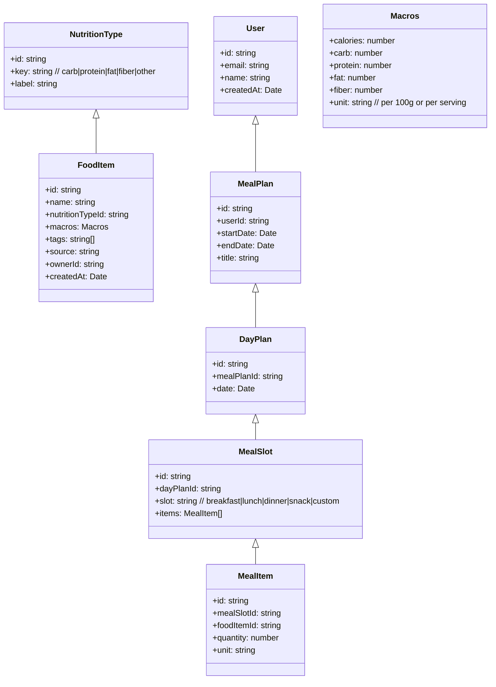
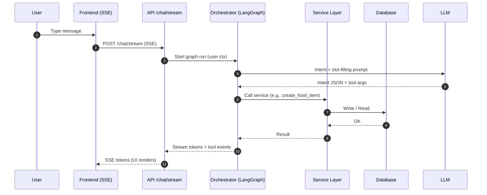
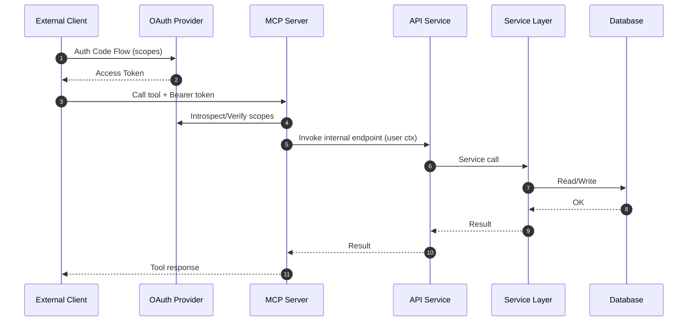
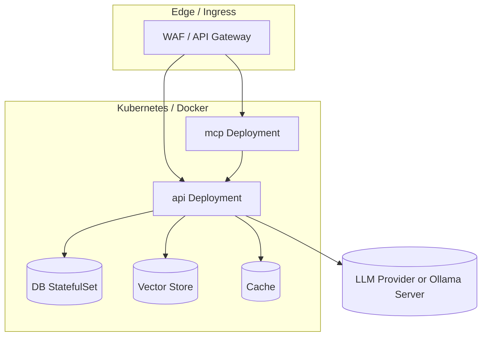

# System Architecture: CarbCyclingWeb (Frontend + Backend + MCP)

## Goals

- Frontend stays React + Vite; keep existing FoodLibrary and MealSlotPlanner.
- Add a backend for CRUD, auth, and LLM orchestration (LangGraph/LangChain).
- Provide an MCP Server for third-party chat clients via OAuth scopes.
- Frontend does NOT embed MCP/LLM; it talks only to the backend.
- Reuse one service layer for HTTP controllers and MCP tools.

## Non-Goals (initial phase)

- No browser-side LLM/MCP or local Ollama in the frontend.
- No direct DB access from MCP; all writes go through service layer.
- No cross-vendor multi-cloud abstraction beyond a thin LLM provider layer.

## High-Level Overview

```mermaid
flowchart LR
  subgraph FE[Frontend (Vite/React)]
    UI[FoodLibrary / MealSlotPlanner / Chat Panel]
  end

  subgraph API[Backend API Service]
    HC[HTTP Controllers (REST/SSE)]
    ORCH[Chat Orchestrator (LangGraph/LangChain)]
    SRV[Service Layer (Food/MealPlan Services)]
  end

  subgraph MCP[MCP Server (External Tools)]
    TOOLS[Registered Tools (safe subset)]
  end

  subgraph DATA[Data & Infra]
    DB[(DB e.g., Postgres)]
    VS[(Vector Store, optional)]
    CACHE[(Cache, optional)]
    LLM[(LLM Providers: OpenAI/Azure/Ollama server-side)]
    OAUTH[[OAuth Provider]]
    LOGS[(Logs/Traces)]
  end

  UI -- REST/SSE --> HC
  HC -- calls --> SRV
  HC -- stream tokens --> UI
  HC -- orchestrates --> ORCH
  ORCH -- tools --> SRV
  ORCH -- call --> LLM
  SRV -- read/write --> DB
  SRV -- embeddings --> VS
  SRV -- cache --> CACHE

  %% External clients use MCP via OAuth
  EXT[External Chat Clients] -- OAuth --> OAUTH
  EXT -- MCP (tools) --> TOOLS
  TOOLS -- introspect/authorize --> OAUTH
  TOOLS -- call services --> SRV
  SRV -- audit --> LOGS
  HC -- audit --> LOGS
```

## Component Responsibilities

- Frontend
  - UI for FoodLibrary and MealSlotPlanner; drag-and-drop and CRUD views.
  - Chat panel talks to `/chat/stream` (SSE) for streaming model output.
  - Auth via OAuth/JWT to the API. No LLM keys stored in browser.

- API Service
  - REST controllers for foods, meal plans, slots; SSE for chat streaming.
  - Orchestrator (LangGraph) interprets intents and calls tools/services.
  - Service layer holds business logic; used by controllers and MCP tools.

- MCP Server
  - Exposes a safe subset of capabilities as MCP tools for external clients.
  - Auth via OAuth. Translates tool calls into service-layer calls (with scopes).
  - No direct DB access; no privileged internal tools are exposed.

- Data & Infra
  - DB: Food items, nutrition types, meal plans, meal slots, users, audit logs.
  - Vector store (optional): semantic search over foods/recipes.
  - Cache: hot reads, idempotency tokens, rate limit counters.
  - LLM providers: called only from backend; can include hosted or self-hosted.
  - OAuth: user identity + token scopes for API and MCP.

## Data Model (Logical)



## API Surface (initial)

- `GET /foods?nutritionType=&q=&limit=&cursor=`
- `POST /foods` (name, nutritionType, macros, tags)
- `GET /foods/:id`
- `PATCH /foods/:id`
- `DELETE /foods/:id`
- `GET /meal-plans/:id`
- `POST /meal-plans` (title, date range)
- `POST /meal-plans/:id/days/:dayId/slots` (create slot)
- `POST /meal-plans/:id/days/:dayId/slots/:slotId/items` (add item)
- `DELETE /meal-plans/:id/days/:dayId/slots/:slotId/items/:itemId`
- `POST /chat/stream` (SSE; body: message, context, client_request_id)

## MCP Tools (scoped)

- `create_food_item({ name, nutritionType, macros, tags? })`
- `search_foods({ query?, nutritionType?, limit? })`
- `add_to_meal_slot({ mealPlanId, day, slot, foodId, quantity, unit })`
- `remove_from_meal_slot({ mealPlanId, day, slot, itemId })`
- `list_nutrition_types()`

Each tool requires OAuth scopes (e.g., `foods:write`, `meals:write`, `foods:read`).
All writes include an idempotency key `client_request_id`.

## Key Flows

### Frontend Chat → Structured Actions



### External MCP Client → Tools with OAuth



## AuthN/AuthZ

- Frontend → API: OAuth/JWT; tokens carry `sub`, tenant, and scopes.
- MCP Client → MCP Server: OAuth with minimal scopes per tool; tokens verified
  by MCP and propagated to service layer.
- Service layer enforces authorization; all writes audited with `correlation_id`.

## Non-Functional Requirements

- Security: least-privilege scopes, WAF on MCP endpoints, prepared statements.
- Idempotency: all mutating operations accept `client_request_id`.
- Rate limiting: per-IP + per-user; separate budgets for MCP and API.
- Observability: structured logs, trace IDs, slow-query logging, prompt logging
  with redaction.
- Performance: cache hot reads (foods search), paginate; streaming chat via SSE.
- Resilience: circuit breakers on LLM calls; retries with backoff; dead-letter
  for failed orchestrations (optional).

## Deployment Topology (recommended)



## Migration Plan (phased)

- Phase 1: Extract service layer; add API routes for CRUD; keep current frontend.
- Phase 2: Add `/chat/stream` with LangGraph orchestrator; wire frontend chat UI.
- Phase 3: Introduce MCP Server as separate process; register safe tools; OAuth.
- Phase 4: Observability, rate limiting, and hardening; optional vector search.

## Open Questions / Risks

- Exact OAuth provider and token format (JWT vs opaque + introspection).
- Vector store choice (pgvector vs external) and SLOs for search.
- LLM provider variability vs quality and latency; prompt versioning policy.
- Multi-tenant isolation strategy if needed.

## Appendix: Suggested Backend Structure

```
server/
  src/
    index.ts (HTTP server)
    chat/ (orchestrator, graph, prompts)
    controllers/ (foods, mealPlans, chat)
    services/ (FoodService, MealPlanService)
    auth/ (oauth, JWT, guards)
    mcp/ (tool registry, server entry)
    db/ (prisma/knex/sql, repositories)
    telemetry/ (logger, tracer)
```
